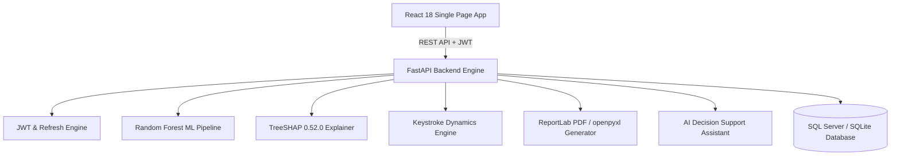
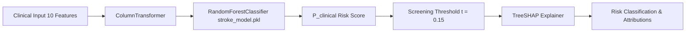

# PreStrokeNet Architecture Specification

This document details the system design, machine learning pipelines, and component relationships in PreStrokeNet.

---

## 1. System Architecture Diagram

---

## 2. Machine Learning Dataflow Diagram

---

## 3. Container & Deployment Architecture

- **Backend Container**: Python 3.12 multi-stage Docker image running Uvicorn ASGI server.
- **Frontend Container**: Node 20 build stage serving optimized production bundle via Nginx web server.
- **Orchestration**: `docker-compose.yml` linking Backend, Frontend, and Database services.
