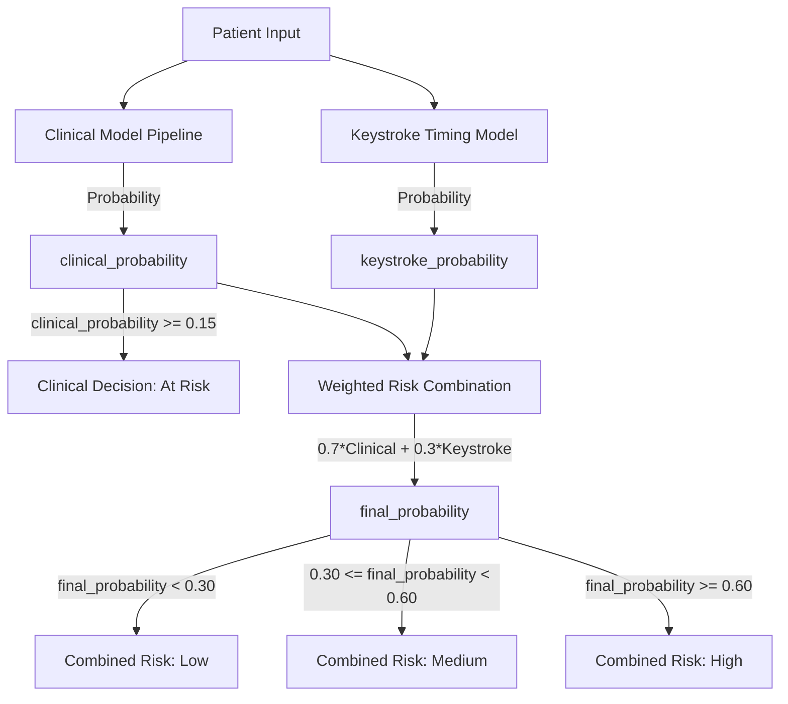

# PreStrokeNet Model & Decision Architecture Documentation

This document describes the Phase 2 model metadata, preprocessing configuration, decision thresholds, and risk-banding structure.

---

## 1. Model Configuration

- **Classifier Type**: `RandomForestClassifier` (Scikit-learn)
- **Class Weights**: `balanced` (Adjusts weights inversely proportional to class frequencies to correct severe class imbalance: ~4.87% stroke cases)
- **Training Dataset**: Healthcare Stroke Dataset (`healthcare-dataset-stroke-data.csv` only)

---

## 2. Feature Preprocessing Pipeline

Preprocessing is fully encapsulated within a scikit-learn `Pipeline` to prevent test-set leakage. The pipeline contains:
- **Numerical Features** (`age`, `avg_glucose_level`, `bmi`):
  - Median Imputation (`SimpleImputer(strategy='median')`)
  - Standard Scaling (`StandardScaler()`)
- **Categorical/Binary Features** (`gender`, `hypertension`, `heart_disease`, `ever_married`, `work_type`, `Residence_type`, `smoking_status`):
  - Most Frequent Imputation (`SimpleImputer(strategy='most_frequent')`)

---

## 3. Decision Boundary & Threshold Isolation

The application deliberately separates individual clinical prediction thresholds from combined risk bands to optimize both clinical utility and system metrics:



### A. Clinical Model Threshold (0.15)
- The continuous `clinical_probability` is calculated by the Random Forest classifier.
- The clinical decision boundary is set at **0.15** for positive case classification (i.e. patients with probability >= 0.15 are clinically marked as at-risk).
- *Continuous probabilities are returned directly to preserve raw measurements.*

### B. Application Combined-Risk Bands (0.30 / 0.60)
The application combines clinical and behavioral inputs using a weighted equation:
$$\text{final\_probability} = 0.7 \times \text{clinical\_probability} + 0.3 \times \text{keystroke\_probability}$$

Combined risk categories are assigned based on the following bands:
- **Low Risk**: $\text{final\_probability} < 0.30$
- **Medium Risk**: $0.30 \le \text{final\_probability} < 0.60$
- **High Risk**: $\text{final\_probability} \ge 0.60$

*Note: These application risk bands are deliberately separated from the clinical model decision threshold.*

---

## 4. Explainable AI (XAI) System

### A. Explainability Method: SHAP TreeExplainer
- **Core Engine**: `shap.TreeExplainer` (SHAP version `0.52.0`) is utilized to compute exact feature attributions for the clinical predictions.
- **Target Estimator**: The explainer directly analyzes the underlying `RandomForestClassifier` extracted from the production Pipeline:
  ```python
  classifier = model.named_steps["classifier"]
  ```
- **Inference Preprocessing**: The patient's raw clinical features are transformed via the pipeline's ColumnTransformer preprocessor before being passed to TreeSHAP:
  ```python
  preprocessed_values = preprocessor.transform(raw_values)
  ```
- **Output Space**: TreeSHAP operates in **Probability Space** for direct additive attribution matching predicted class-1 probabilities:
  $$\text{predicted\_probability} = \text{base\_value} + \sum \text{SHAP\_contributions}$$
- **Features Alignment & Mapping**: Transformed SHAP feature attributions are dynamically mapped back to their original clinical variable names (`age`, `avg_glucose_level`, `bmi`, etc.).

### B. Fallback Strategy: Bounded Feature Sensitivity
If the `shap` package is dynamically unavailable or fails to execute, the service automatically falls back to an **approximate sensitivity** mapping strategy (`approximate_sensitivity` mode) to guarantee backend API availability and prevent application crashes.

### C. Clinical & Causation Disclaimer
> [!IMPORTANT]
> SHAP feature contributions represent statistical model attributions (how the model arrived at its prediction) based on training data associations. They **do not** prove medical causation or replace professional clinical judgment.

---

## 5. Phase 6 AI Clinical Decision-Support Assistant Architecture

### A. Core Objective & Scope
The AI Assistant acts as a context-aware decision-support and explanation layer for clinicians. It explains existing PreStrokeNet outputs (predictions, SHAP factors, risk trends, doctor notes, model metrics) without independently diagnosing patients, prescribing treatments, or replacing clinical judgment.

### B. Architecture & Provider Abstraction
- **Pluggable Provider Abstraction** (`BaseAIProvider`):
  - `GroundedRuleProvider` (default): built-in data-grounded reasoning engine providing 100% facts-grounded, zero-hallucination answers with citations.
  - `OpenAICompatibleProvider`: connects to external LLM provider endpoints when configured.
- **Server-Side Context Retrieval**: Patient record, predictions, SHAP attributions, progression trends, doctor notes, and model analytics are authoritatively retrieved directly from database services (`prediction_service`, `explainability_service`, `analytics_service`). Client-supplied values are ignored.

### C. Safety Guardrails
1. **No Independent Diagnosis**: Requests asking for a definitive medical diagnosis are redirected to comprehensive clinical evaluation.
2. **No Prescription or Emergency Guidance**: Requests for medications or emergency treatment are redirected to immediate emergency medical care.
3. **Model Attribution vs Causation**: Feature attributions are strictly framed as model contributions rather than physiological causal factors.
4. **Citation Source Badges**: Every response is linked to specific application context sources (`Latest Prediction`, `Patient History`, `SHAP Explanation`, `Doctor Notes`, `Model Analytics`).

